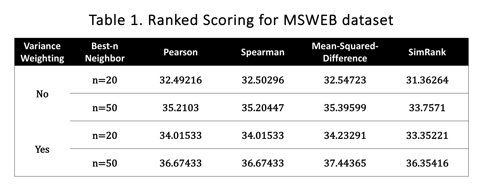
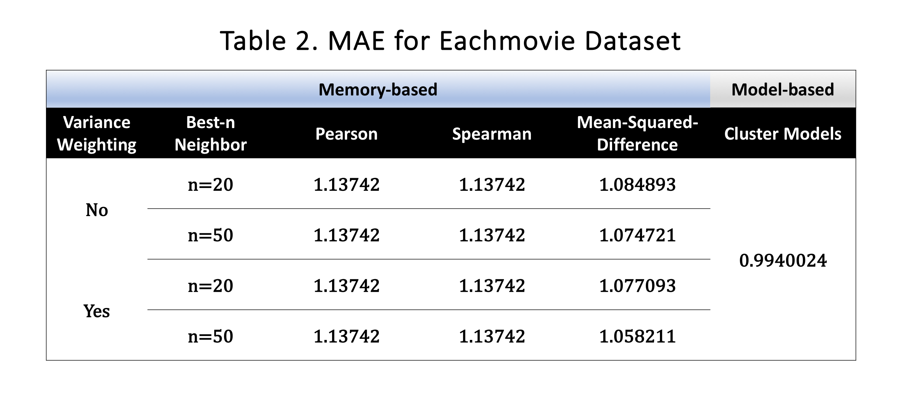

In this project, we tested two general classes of collaborative filtering algorithms, one is memory-based and the other is model-based.  

# Dataset
The datasets we used in this project are part of Microsoft Website dataset and Eachmovie dataset. The MSWEB dataset is an example of implicit voting data, with each vroot characterized as being visited (vote of one) or not (no vote). The EachMovie dataset is an explicit voting example using data, with votes ranging in value from 0 to 5.
```{r}
# MS
movie_train <- read.csv("../data/eachmovie_sample/data_train.csv")
movie_test <- read.csv("../data/eachmovie_sample/data_test.csv")
# Movie
MS_train <- read.csv("../data/MS_sample/data_train.csv")
MS_test <- read.csv("../data/MS_sample/data_test.csv")
```

# Preprocess
```{r}
source("../lib/data_preprocess.R")
movie_train <- Transformer(movie_train)
movie_test <- Transformer(movie_test)
# save(movie_train, file = "../output/clean_movie_train.RData")
# save(movie_test, file = "../output/clean_movie_test.RData")

MS_train <- Transformer2(MS_train)
MS_test <- Transformer2(MS_test)
# save(MS_train, file = "../output/clean_MS_train.RData")
# save(MS_test, file = "../output/clean_MS_test.RData")
```

# Memory-based Algorithm
For the memory-based algorithms, we tested the performance of four similarity metrics with and without variance weighting. The best-20 and best 50 neighbors are respectively selected using each algorithm and predictions are computed from those neighbors. As for evaluation, we compared the performance for these different algorithms by ranked scoring for MS dataset and MAE for EachMovie dataset.

## Similarity Weight
### Pearson Correlation(not required)
```{r}
# # MS
# pearson_weight_ms <- cor(t(ms_train_mat), method = "pearson")
# save(pearson_weight_ms, file="../output/pearson_weight_ms.RData")

# # Movie
# pearson_weight_movie <- cor(t(movie_train_mat), method = "pearson", use = "pairwise.complete.obs")
# save(pearson_weight_movie, file="../output/pearson_weight_movie.RData")
```

### Spearman Correlation(1,2)
```{r}
# # MS
# spearman_weight_ms <- cor(t(ms_train_mat), method = "spearman")
# save(spearman_weight_ms, file="../output/spearman_weight_ms.RData")

# # Movie
# spearman_weight_movie <- cor(t(movie_train_mat), method = "spearman", use = "pairwise.complete.obs")
# save(spearman_weight_movie, file="../output/spearman_weight_movie.RData")
```

### Mean-square-difference(1,2)
```{r}
# msd_weight <- function(mat){
#   n <- dim(mat)[1]
#   dissim <- matrix(NA, n, n)
#   user <- rownames(mat)
#   colnames(dissim) <- user
#   rownames(dissim) <- user
#   for (i in 1:n){
#     for (j in 1:n){
#       ui <- mat[i,]
#       uj <- mat[j,]
#       dissim[i,j] <- mean((ui - uj)^2, na.rm = T)
#     }
#   }
#   L <- max(dissim, na.rm = T)
#   w <- (L - dissim)/L
#   return(w)
# }
#  
# msd_weight2 <- function(df){
#   n_user <- dim(df)[1]
#   n_item <- dim(df)[2]
#   c <- df
#   c[which(c>0)] = 1
#   s <- df
#   dissim <- matrix(NA, n_user, n_user)
#   user <- rownames(df)
#   colnames(dissim) <- user
#   rownames(dissim) <- user
#   for (i in 1:n_user){
#     for (j in 1:n_user){
#       t <- 0
#       b <- 0
#       for (n in 1:n_item){
#         t <- t + c[i,n]*c[j,n]*(s[i,n]-s[j,n])^2
#         b <- b + c[i,n]*c[j,n]
#       }
#       dissim[i,j] <- t/b
#       print(paste(i,j,t,b,dissim))
#     }
#   }
#   L <- max(dissim)
#   w <- (L - dissim)/L
#   return (w)
# }
#
# msd_weight_ms <- msd_weight(ms_train_mat)
# save(msd_weight_ms, file="../output/msd_weight_ms.RData")
# msd_weight_movie <- msd_weight(movie_train_mat)
# save(msd_weight_movie, file="../output/msd_weight_movie.RData")
```

### Simrank(1)
```{r}
# # MS
# # load pkg and data
# library("igraph")
# load("../output/ms_train_mat.RData")
# 
# # create the network graph
# users <- rownames(ms_train_mat)
# votes <- colnames(ms_train_mat)
# nodes <- c(users, votes)
# df_edges <- data.frame()
# for (i in 1:length(users)){
#   sink <- names(which(ms_train_mat[i,]==1))
#   n_edges <- length(sink)
#   edges <- data.frame(rep(users[i],n_edges), sink)
#   colnames(edges) <- c("from","to")
#   df_edges <- rbind(df_edges, edges)  
# }
# graph <- graph_from_data_frame(d=df_edges, vertices=nodes, directed=F) 
# graph
# save(graph, file="../output/graph_ms.RData")
# 
# # matrix representation of simrank
# # adjacency matrix
# A <- as_adjacency_matrix(graph)
# A <- as.matrix(A, "adjacency")
# # normalized by columns
# W <- scale(A, center=FALSE, scale=colSums(A))
# I <- diag(length(nodes))
# S <- diag(length(nodes))
# simrank <- function(C = 0.8, K = 5){
#   #res <- list()
#   for (k in 1:K){
#     X <- t(W) %*% S %*% W
#     D <- I
#     diag(D) <- diag(X)
#     S <- C*X - C*D + I
#     #res[[k]] <- S
#   }
#   return(S)
# }
# simrank_weight <- simrank()[1:4151,1:4151]
# save(simrank_weight, file="../output/simrank_weight_ms.RData")
# 
# # basic simrank equation
# # neighbors(graph, v, mode = c("out", "in", "all", "total"))
# get_votes <- function(user){
#   votes <- neighbors(graph, user, mode = "out")
#   return(votes)
# }
# 
# get_users <- function(vote){
#   users <- neighbors(graph, vote, mode = "in")
#   return(users)
# }
# 
# # simrank
# user_sim <- diag(length(users))
# vote_sim <- diag(length(votes))
# 
# user_simrank <- function(u1, u2, C) {
#   if (u1 == u2){
#     return(1)
#   } 
#   else {
#     pre <- C / (length(get_votes(u1)) * length(get_votes(u2)))
#     post <- 0
#     for (i in get_votes(u1)){
#       for (j in get_votes(u2)){
#         o1 <- match(nodes[i], votes)
#         o2 <- match(nodes[j], votes)
#         #print(paste(o1,o2,post,vote_sim[o1, o2]))
#         post <- post + vote_sim[o1, o2]
#       }
#     }
#     return(pre*post)
#   }
# }
# 
# vote_simrank <- function(v1, v2, C) {
#   if (v1 == v2){
#     return(1)
#   } 
#   else {
#     pre <- C / (length(get_users(v1)) * length(get_users(v2)))
#     post <- 0
#     for (i in get_users(v1)){
#       for (j in get_users(v2)){
#         i1 <- match(nodes[i], users)
#         i2 <- match(nodes[j], users)
#         post <- post + user_sim[i1, i2]
#       }
#     }
#     return(pre*post)
#   }
# }
# 
# simrank <- function(C = 0.8, K = 1, calc_user = T, calc_vote = F){
#   
#   for (k in 1:K){
#     
#     if(calc_user){
#       for (ui in users){
#         for (uj in users){
#           i <- match(ui, users)
#           j <- match(uj, users)
#           sim <- user_simrank(ui, uj, C)
#           user_sim[i, j] <- sim
#           print(paste(ui, uj, sim))
#         }
#       }
#     }
#     
#     if(calc_vote){
#       for (vi in votes){
#         for (vj in votes){
#           i <- match(vi, votes)
#           j <- match(vj, votes)
#           sim <- vote_simrank(vi, vj, C)
#           vote_sim[i, j] <- sim
#           print(paste(vi, vj, sim))
#         }
#       }
#     }
#   }
# }
```

## Variance Weighting
```{r}
# # Variance Weighting
# find_var <- function(mat=movie_train){
#   vari <- apply(mat, 2, var, na.rm=TRUE)
#   var_max <- max(vari, na.rm = TRUE)
#   var_min <- min(vari, na.rm = TRUE)
#   vi <- (vari - var_min)/var_max
#   return(vi)
# }
# 
# variance_weight_assign <- function(i, j, vi, mat=movie_train){
#   zai <- scale(mat[i, ])
#   zui <- scale(mat[j, ])
#   index <- intersect(which(!is.na(zai)), which(!is.na(zui)))
#   wau <- sum(vi[index]*zai[index]*zui[index])/sum(vi[index])
#   return(wau)
# }
# 
# variance_weight_matrix <- function(mat_dim_1, mat = movie_train){
#   mat_weight = matrix(1, nrow=mat_dim_1, ncol=mat_dim_1)
#   vi <- find_var(mat = mat)
#   for (i in 1:(mat_dim_1-1)){
#     print(i)
#     print(Sys.time())
#     for (j in (i+1):mat_dim_1){
#       wau <- variance_weight_assign(i, j, vi, mat = movie_train)
#       mat_weight[i, j] <- wau
#       mat_weight[j, i] <- wau
#     }
#   }
#   return(mat_weight)
# }
# 
# movie_train <- Transformer(movie_train)
# movie_test <- Transformer(movie_test)
# MS_train <- Transformer2(MS_train)
# MS_test <- Transformer2(MS_test)
# 
# # Movie
# mat_variance_weight_movie <- variance_weight_matrix(dim(movie_train)[1], mat = movie_train)
# #mat_variance_weight_movie[is.na(mat_variance_weight_movie)] = 0
# save(mat_variance_weight_movie, file = "variance_weight_Movie.RData")
# 
# # MS
# mat_variance_weight_MS <- variance_weight_matrix(dim(MS_train)[1], mat = MS_train)
# #mat_variance_weight_MS[is.na(mat_variance_weight_MS)] = 0
# save(mat_variance_weight_MS, file = "variance_weight_MS.RData")
```

## Selecting n-neighboors & Prediction
```{r}
# select_n_neighbour
source("../lib/select_n_neighbour.R")

adjust <- function(matrix){
  matrix[is.na(matrix)] <- 0
  return(matrix)
}

# prediction
source("../lib/prediction.R")
```

### pearson
```{r}
load('../output/weight_martix/movie/pearson_weight_movie.RData')
pearson_weight_movie <- adjust(pearson_weight_movie)

load('../output/weight_martix/ms/pearson_weight_ms.RData')
pearson_weight_ms <- adjust(pearson_weight_ms)

pr.movie.neighbor =  neighbors.select(pearson_weight_movie, n = 20)
pr.MS.neighbor = neighbors.select(pearson_weight_ms, n = 20)

pr.movie.pred = pred.matrix.movie(simweights =pearson_weight_movie, top.neighbors = pr.movie.neighbor)
pr.MS.pred = pred.matrix.ms(simweights =pearson_weight_ms, top.neighbors = pr.MS.neighbor)

# save(pr.movie.pred, file="../output/prediction/movie/pred_pearson_movie.RData")
# save(pr.MS.pred, file="../output/prediction/ms/pred_pearson_ms.RData")

pr.movie.neighbor1 =  neighbors.select(pearson_weight_movie, n = 50)
pr.MS.neighbor1= neighbors.select(pearson_weight_ms, n = 50)

pr.movie.pred1 = pred.matrix.movie(simweights =pearson_weight_movie, top.neighbors = pr.movie.neighbor1)
pr.MS.pred1 = pred.matrix.ms(simweights =pearson_weight_ms, top.neighbors = pr.MS.neighbor1)

# save(pr.movie.pred1,file="../output/prediction/movie/pred_pearson_movie1.RData")
# save(pr.MS.pred1, file="../output/prediction/ms/pred_pearson_ms1.RData")
```

### spearman
```{r}
load('../output/weight_martix/movie/spearman_weight_movie.RData')
spearman_weight_movie <- adjust(spearman_weight_movie)

load('../output/weight_martix/ms/spearman_weight_ms.RData')
spearman_weight_ms <- adjust(spearman_weight_ms)

sp.movie.neighbor =  neighbors.select(spearman_weight_movie, n = 20)
sp.MS.neighbor = neighbors.select(spearman_weight_ms, n = 20)

sp.movie.pred = pred.matrix.movie(simweights =spearman_weight_movie, top.neighbors = sp.movie.neighbor)
sp.MS.pred = pred.matrix.ms(simweights =spearman_weight_ms, top.neighbors = sp.MS.neighbor)

# save(sp.movie.pred, file="../output/prediction/movie/pred_spearman_movie.RData")
# save(sp.MS.pred, file="../output/prediction/ms/pred_spearman_ms.RData")

sp.movie.neighbor1 =  neighbors.select(spearman_weight_movie, n = 50)
sp.MS.neighbor1 = neighbors.select(spearman_weight_ms, n = 50)

sp.movie.pred1 = pred.matrix.movie(simweights =spearman_weight_movie, top.neighbors = sp.movie.neighbor1)
sp.MS.pred1 = pred.matrix.ms(simweights =spearman_weight_ms, top.neighbors = sp.MS.neighbor1)

# save(sp.movie.pred1,file="../output/prediction/movie/pred_spearman_movie1.RData")
# save(sp.MS.pred1, file="../output/prediction/ms/pred_spearman_ms1.RData")
```

### msd
```{r}
load('../output/weight_martix/movie/msd_weight_movie.RData')
msd_weight_movie <- adjust(msd_weight_movie)

load('../output/weight_martix/ms/msd_weight_ms.RData')
msd_weight_ms <- adjust(msd_weight_ms)

msd.movie.neighbor =  neighbors.select(msd_weight_movie, n = 20)
msd.MS.neighbor = neighbors.select(msd_weight_ms, n = 20)

msd.movie.pred = pred.matrix.movie(simweights =msd_weight_movie, top.neighbors = msd.movie.neighbor)
msd.MS.pred = pred.matrix.ms(simweights =msd_weight_ms, top.neighbors = msd.MS.neighbor)

# save(msd.movie.pred, file="../output/prediction/movie/pred_msd_movie.RData")
# save(msd.MS.pred, file="../output/prediction/ms/pred_msd_ms.RData")

msd.movie.neighbor1 =  neighbors.select(msd_weight_movie, n = 50)
msd.MS.neighbor1 = neighbors.select(msd_weight_ms, n = 50)

msd.movie.pred1 = pred.matrix.movie(simweights =msd_weight_movie, top.neighbors = msd.movie.neighbor1)
msd.MS.pred1 = pred.matrix.ms(simweights =msd_weight_ms, top.neighbors = msd.MS.neighbor1)

# save(msd.movie.pred1, file="../output/prediction/movie/pred_msd_movie1.RData")
# save(msd.MS.pred1, file="../output/prediction/ms/pred_msd_ms1.RData")
```

### simrank
```{r}
load('../output/weight_martix/ms/simrank_weight_ms.RData')
simrank_weight_ms <- adjust(simrank_weight_ms)

sim.MS.neighbor = neighbors.select(simrank_weight_ms, n = 20)
sim.MS.pred = pred.matrix.ms(simweights =simrank_weight_ms, top.neighbors = sim.MS.neighbor)
# save(sim.MS.pred, file="../output/prediction/ms/pred_sim_ms.RData")

sim.MS.neighbor1 = neighbors.select(simrank_weight_ms, n = 50)
sim.MS.pred1 = pred.matrix.ms(simweights =simrank_weight_ms, top.neighbors = sim.MS.neighbor1)
# save(sim.MS.pred1, file="../output/prediction/ms/pred_sim_ms1.RData")
```

### var
```{r}
load('../output/weight_martix/movie/variance_weight_movie.RData')
variance_weight_movie <- adjust(mat_variance_weight)

load('../output/weight_martix/ms/variance_weight_MS.RData')
variance_weight_MS <- adjust(mat_variance_weight)

var.movie.neighbor =  neighbors.select(variance_weight_movie, 20)
var.MS.neighbor = neighbors.select(variance_weight_MS, 20)

var.movie.pred = pred.matrix.movie(simweights =variance_weight_movie, top.neighbors = var.movie.neighbor)
var.MS.pred = pred.matrix.ms(simweights =variance_weight_MS, top.neighbors = var.MS.neighbor)

# save(var.movie.pred, file="../output/prediction/movie/pred_var_movie.RData")
# save(var.MS.pred, file="../output/prediction/ms/pred_var_ms.RData")

var.movie.neighbor1 =  neighbors.select(variance_weight_movie, 50)
var.MS.neighbor1 = neighbors.select(variance_weight_MS, 50)

var.movie.pred1 = pred.matrix.movie(simweights =variance_weight_movie, top.neighbors = var.movie.neighbor1)
var.MS.pred1 = pred.matrix.ms(simweights =variance_weight_MS, top.neighbors = var.MS.neighbor1)

# save(var.movie.pred1, file="../output/prediction/movie/pred_var_movie1.RData")
# save(var.MS.pred1, file="../output/prediction/ms/pred_var_ms1.RData")
```

## Evaluation
### Without Variance
```{r}
source("../lib/evaluation.R")

# Movie + TOP 20
pearson.movie.mae = evaluation.mae(pr.movie.pred, movie_test)
spearman.movie.mae = evaluation.mae(sp.movie.pred, movie_test)
msd.movie.mae = evaluation.mae(msd.movie.pred, movie_test)

# Movie + TOP 50
pearson.movie.mae1 = evaluation.mae(pr.movie.pred1, movie_test)
spearman.movie.mae1 = evaluation.mae(sp.movie.pred1, movie_test)
msd.movie.mae1 = evaluation.mae(msd.movie.pred1, movie_test)

# MS + TOP 20
pearson.MS.rs = rank_score(pr.MS.pred, MS_test)
spearman.MS.rs = rank_score(sp.MS.pred, MS_test)
msd.MS.rs = rank_score(msd.MS.pred, MS_test)
sim.MS.rs = rank_score(sim.MS.pred, MS_test)

# MS + TOP 50
pearson.MS.rs1 = rank_score(pr.MS.pred1, MS_test)
spearman.MS.rs1 = rank_score(sp.MS.pred1, MS_test)
msd.MS.rs1 = rank_score(msd.MS.pred1, MS_test)
sim.MS.rs1 = rank_score(sim.MS.pred1, MS_test)
```

### With Variance
```{r}
# Pearson + Variance
pearson.var.movie = variance_weight_movie * pearson_weight_movie
pearson.var.MS = variance_weight_MS * pearson_weight_ms
pearson.var.movie.neighbor =  neighbors.select(pearson.var.movie, n = 20)
pearson.var.MS.neighbor = neighbors.select(pearson.var.MS, n = 20)
pearson.var.movie.pred = pred.matrix.movie(simweights =pearson.var.movie,top.neighbors = pearson.var.movie.neighbor)
pearson.var.MS.pred = pred.matrix.ms(simweights =pearson.var.MS, top.neighbors =pearson.var.MS.neighbor)

pearson.var.movie.neighbor1 =  neighbors.select(pearson.var.movie, n = 50)
pearson.var.MS.neighbor1 = neighbors.select(pearson.var.MS, n = 50)
pearson.var.movie.pred1 = pred.matrix.movie(simweights =pearson.var.movie,top.neighbors = pearson.var.movie.neighbor1)
pearson.var.MS.pred1 = pred.matrix.ms(simweights =pearson.var.MS, top.neighbors =pearson.var.MS.neighbor1)

# Spearman + Variance
spearman.var.movie = variance_weight_movie * spearman_weight_movie
spearman.var.MS = variance_weight_MS * spearman_weight_ms
spearman.var.movie.neighbor =  neighbors.select(spearman.var.movie, n=20)
spearman.var.MS.neighbor = neighbors.select(spearman.var.MS, n=20)
spearman.var.movie.pred = pred.matrix.movie(simweights =spearman.var.movie,top.neighbors = spearman.var.movie.neighbor)
spearman.var.MS.pred = pred.matrix.ms(simweights =spearman.var.MS,top.neighbors = spearman.var.MS.neighbor)

spearman.var.movie.neighbor1 =  neighbors.select(spearman.var.movie, n=50)
spearman.var.MS.neighbor1 = neighbors.select(spearman.var.MS, n=50)
spearman.var.movie.pred1 = pred.matrix.movie(simweights =spearman.var.movie,top.neighbors = spearman.var.movie.neighbor1)
spearman.var.MS.pred1 = pred.matrix.ms(simweights =spearman.var.MS,top.neighbors = spearman.var.MS.neighbor1)

# MSD + Variance
msd.var.movie = variance_weight_movie * msd_weight_movie
msd.var.MS = variance_weight_MS * msd_weight_ms
msd.var.movie.neighbor =  neighbors.select(msd.var.movie, n=20)
msd.var.MS.neighbor = neighbors.select(msd.var.MS, n=20)
msd.var.movie.pred = pred.matrix.movie(simweights =msd.var.movie,top.neighbors = msd.var.movie.neighbor)
msd.var.MS.pred = pred.matrix.ms(simweights =msd.var.MS,top.neighbors = msd.var.MS.neighbor)

msd.var.movie.neighbor1 =  neighbors.select(msd.var.movie, n=50)
msd.var.MS.neighbor1 = neighbors.select(msd.var.MS, n=50)
msd.var.movie.pred1 = pred.matrix.movie(simweights =msd.var.movie,top.neighbors = msd.var.movie.neighbor1)
msd.var.MS.pred1 = pred.matrix.ms(simweights =msd.var.MS,top.neighbors = msd.var.MS.neighbor1)

# SimRank + Var
simrank.var.ms = variance_weight_MS * simrank_weight_ms
simrank.var.ms.neighbor =  neighbors.select(simrank.var.ms, n=20)
simrank.var.ms.pred = pred.matrix.ms(simweights =simrank.var.ms,top.neighbors = simrank.var.ms.neighbor)

simrank.var.ms1 = variance_weight_MS * simrank_weight_ms
simrank.var.ms.neighbor1 =  neighbors.select(simrank.var.ms, n=50)
simrank.var.ms.pred1 = pred.matrix.ms(simweights =simrank.var.ms,top.neighbors = simrank.var.ms.neighbor1)
```

```{r}
# Movie + TOP 20
pearson.var.movie.mae = evaluation.mae(pearson.var.movie.pred, movie_test)
spearman.var.movie.mae = evaluation.mae(spearman.var.movie.pred, movie_test)
msd.var.movie.mae = evaluation.mae(msd.var.movie.pred, movie_test)

# Movie + TOP 50
pearson.var.movie.mae1 = evaluation.mae(pearson.var.movie.pred1, movie_test)
spearman.var.movie.mae1 = evaluation.mae(spearman.var.movie.pred1, movie_test)
msd.var.movie.mae1 = evaluation.mae(msd.var.movie.pred1, movie_test)

# MS + TOP 20
pearson.var.MS.rs = rank_score(pearson.var.MS.pred, MS_test)
spearman.var.MS.rs = rank_score(spearman.var.MS.pred, MS_test)
msd.var.MS.rs = rank_score(msd.var.MS.pred, MS_test)
sim.var.MS.rs = rank_score(simrank.var.ms.pred, MS_test)

# MS + TOP 50
pearson.var.MS.rs1 = rank_score(pearson.var.MS.pred1, MS_test)
spearman.var.MS.rs1 = rank_score(spearman.var.MS.pred1, MS_test)
msd.var.MS.rs1 = rank_score(msd.var.MS.pred1, MS_test)
sim.var.MS.rs1 = rank_score(simrank.var.ms.pred1, MS_test)
```

# Model-based Algorithm: Cluster Models
For the model-based algorithm, we test the performance of cluster models on Eachmovie dataset. We set the maximum iteration equals to 30 and the convergence conditions for EM algorithm. And then we apply 5-fold cross validation to select the best cluster size C. According to MAE evaluation, we select 6 as the best cluster size. Finally, we evaluate the algorithm on the test set and get the MAE equals to 0.994.

### Load data and set command
```{r}
movie_train <- read.csv("../data/eachmovie_sample/data_train.csv")[,-1]
movie_test <- read.csv("../data/eachmovie_sample/data_test.csv")[,-1]

source("../lib/cluster_model.R")
cv.cluster.models <- FALSE
```

### Cross validation for choosing cluster size C
```{r}
T <- 30           # maximum iterations
if(cv.cluster.models) {
  C_range <- 3:8
  F <- 5          # 5-fold
  cv.result <- cross.validation(movie_train, C_range, F, T) 
  C_opt <- cv.result$C_opt
} else {
  C_opt <- 6
}
```

### Test set evaluation 
```{r}
user.id <- sort(unique(movie_train$User))
movie.id <- sort(unique(movie_train$Movie))
N <- length(user.id)
M <- length(movie.id)
params <- EM_ClusterModel(movie_train, C_opt, T, N, M, movie.id, user.id)
score.est <- estimate.score(movie_test, params, movie.id, user.id)
evaluation.mae(score.est, movie_test$Score)
```

# Summary
The MSWEB table shows ranked scoring for the Microsoft website dataset with higher scores indicating better performance. We can see from the table that the performance of Pearson and Spearman are pretty close, and the performances of Mean-Squared-Difference are always the best among four similarity metrics. And also, by including variance weighting and expanding neighborhood, the performance gets better. Specifically, the combination of mean-squared-difference, variance weighting and best-n = 50 performs the best with the highest score equals to 37.44


The EachMovie table shows Mean absolute error for Eachmovie dataset. The smaller the MAE is, the better the performance is. For memory-based algorithm, we get the same conclusion with last table that the combination of mean-squared-difference, variance weighting and best-n = 50 performs the best with smallest MAE equals to 1.058. For model-based algorithm, the MAE of cluster models is 0.994. In this case, the cluster model performs the best.
